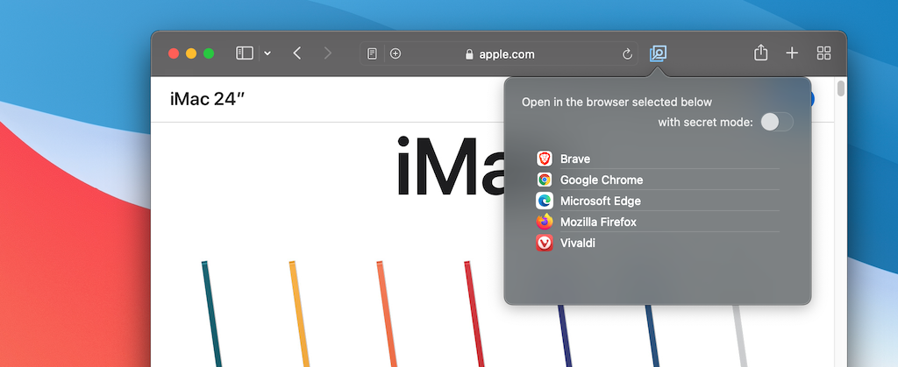

# OpenOthers

This is a Safari App Extension that allows you to open the viewing page in another browser easily. 

This extension now supports the following browsers.
These browsers are detected automatically.

- Google Chrome
- Mozilla Firefox
- Microsoft Edge
- Opera Neon
- Brave
- Vivaldi

This extension is also able to open in Safari itself as new window.

## DESCRIPTION

This extension consists of the following three applications.

### 1. OpenOthers.app

This is an application that hosts the `OpenOthers Extension.appex`.
This application only needs for integration the extension to Safari.

### 2. OpenOthers Extension.appex

This is an app extension to requesting opening a viewing page in other browser.
To install this app extension, a toolbar item that can open other browser is embedded in Safari's toolbars.

When the toolbar item is clicked, an opening request will be sent to `OpenOthersLauncher.app` with the URL of showing page and browser information to open the URL.

### 3. OpenOthersLauncher.app

This is a helper application that receive opening requests sended by `OpenOthers Extension.appex`.
Once this application receives a request from the extension, the url specified by the request will be opened in the browser specified by the request.

This application is also used to install applications as described above.

> Only this application is executed outside of the app sandbox.

## INSTALLATION

First, Place both `OpenOthers.app` and `OpenOthersLauncher.app` in your application folder.

Then, execute `OpenOthersLauncher.app` to allow macOS to send URL schemes to this application and to be able to enabling the extension in Safari.

Finally, open the preferences of Safari, then enable `EZ-NET OpenOthers Extension` in extension tab.

## HOW TO USE

1. Open a page you want to open in other browser in Safari.
1. Click toolbar item of the extension. Then browsers you can select are listed.
1. To select a browser, the page that is currently shown will be opened in the specified browser.
